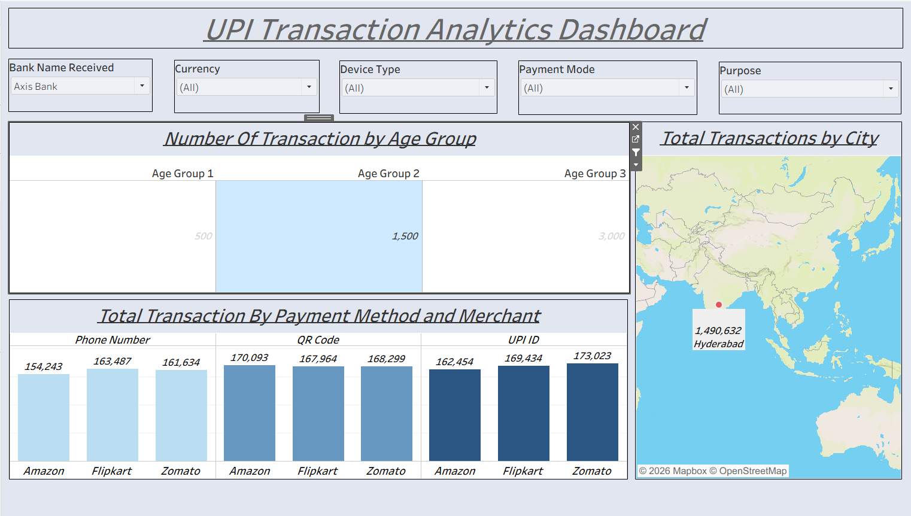

# 💳 UPI Transaction Analytics Dashboard | Tableau

An interactive **UPI Transaction Analytics Dashboard** developed using **Tableau** to analyze digital payment behavior and uncover meaningful patterns across cities, age groups, payment methods, merchants, devices, and transaction purposes.

## 📊 Dashboard Preview

## 🎯 Project Objective

The objective of this project is to transform UPI transaction data into an interactive business intelligence dashboard that helps users explore transaction patterns and understand customer payment behavior.

## 🔍 Key Analysis

The dashboard provides insights into:

- 📍 **City-wise transaction activity** using geographic analysis
- 👥 **Transaction distribution across age groups**
- 💳 **Payment method performance**
- 🏪 **Merchant-level transaction analysis**
- 🏦 **Bank-wise transaction analysis**
- 📱 **Device type analysis**
- 💱 **Currency-based analysis**
- 🎯 **Transaction purpose analysis**

## ⚡ Interactive Features

The dashboard includes dynamic filters that allow users to analyze transactions based on:

- Bank Name
- Currency
- Device Type
- Payment Mode
- Purpose

These filters enable users to explore the data from multiple business perspectives and identify relevant transaction patterns.

## 📈 Dashboard Components

The dashboard combines multiple visualizations, including:

- Geographic Map
- Age Group Analysis
- Payment Method Analysis
- Merchant Analysis
- Interactive Filters
- Comparative Bar Charts
- KPI-style visualizations

## 🛠️ Tools & Technologies

- **Tableau**
- Data Visualization
- Data Analysis
- Business Intelligence
- Interactive Dashboard Design
- Geographic Analysis
- Data Storytelling

## 💡 Key Skills Demonstrated

- Interactive Dashboard Development
- Data Visualization
- Exploratory Data Analysis
- Customer Segmentation
- Transaction Analysis
- Geographic Visualization
- Business Intelligence
- Data Storytelling

## 📁 Project Files

| File | Description |
|------|-------------|
| `UPI_Transaction_Analytics_Dashboard.twbx` | Tableau packaged workbook |
| `UPI_Dashboard.png` | Dashboard preview |
| `README.md` | Project documentation |

## 🚀 How to Use

1. Download the `.twbx` file from this repository.
2. Open it using **Tableau Desktop / Tableau Public**.
3. Explore the dashboard and interact with the available filters.
4. Analyze transaction patterns across different dimensions.

## 👤 Author

### Kushagra Kumar

**Aspiring Data Analyst | Data Visualization | Business Intelligence**

- GitHub: [KushagraKumar-r](https://github.com/KushagraKumar-r)
- LinkedIn: [Connect with me](https://www.linkedin.com/in/kushagra-kumar-14051826a/)

---

⭐ If you find this project useful, feel free to star the repository!
